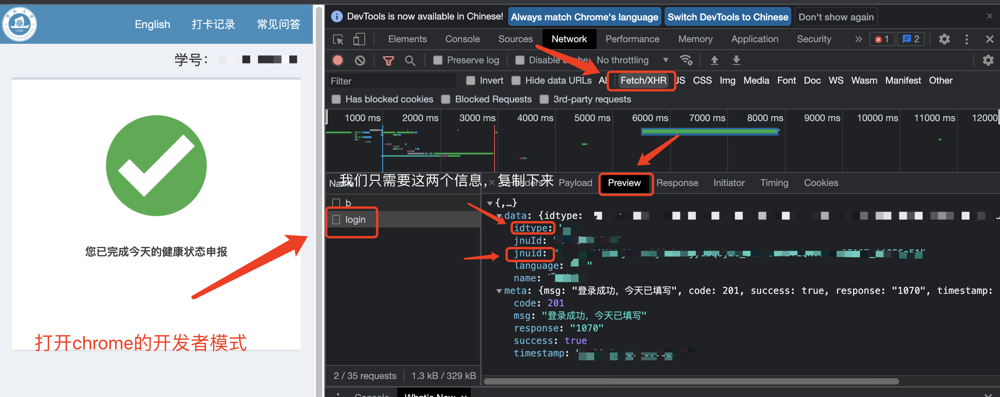

# 暨南大学打卡小助手

**使用前请手动填写信息打一次卡，之后便自动拉取上一次填写的信息进行提交。**

如果用着觉得不错的话，记得点一下Star哦！

## 2021.11.27更新

学校在登录界面设置了行为验证码拦截，现在必须登录进入表单后，获取这些信息：



然后，使用我们的工具进行打卡：

```shell
/path/to/jnuhealth -junid {your_jnuid} -type {your_idtype}
```

作者会在不久的将来支持daemon化，便于部署至服务器上自动打卡。

### 安装

可以在本项目的released下载，已测试可跨平台运行。

## 2021.8.8更新

支持新的`post`数据`secondTable`。

## 2021.5.7更新

支持daemon化，在`main.py`里的`attend_list`填上自己的学号密码，运行即可：

```bash
python3 main.py
```

daemon的pid在当前目录下的pidfile里，退出只需`kill`即可。

## 2021.2.3更新

直接给你们脚本，有用代码也就几十行，不多，大部分都是信息占行数。

使用前只需安装`Python3`和`Requests`库即可，之后按照代码里的注释操作(`Line 118`开始)。

自动打卡可能要配合服务器使用，没有服务器就还是手动，但是方便很多。

```bash
alias a="python3 /your-path-to/main.py" # 创建别名
a # 执行
```

每天记得打开命令行输入一下`a`就好了，就这样，使用愉快。
